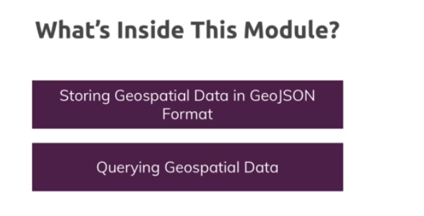

# 9-Geospatial

1. [Intro](#schema1)
2. [Adding GeoJSON Data](#schema2)


<hr>

<a name="schema1"></a>

## 1. Intro



<hr>

<a name="schema2"></a>

## 2. Adding GeoJSON Data

- Estructura de GeoJson
```
 location: { type: 'objecgt_type', <field>: [<longitude>, <latitude> ] }
```
https://www.mongodb.com/docs/manual/reference/geojson/

```
db.places.findOne()
{
  _id: ObjectId('65719eaf74f4b572c98e93a4'),
  name: 'California Academy of Sciences',
  location: { type: 'Point', coordinates: [ -122.4724356, 37.7672544 ] }

```

<hr>

<a name="schema3"></a>

## 3. Running Geo Queries


```
db.places.find({$near:{$geometry:{type:'Point',coordinates:[-127.471114, 37.771104]}}})
MongoServerError: unknown top level operator: $near. If you have a field name that starts with a '$' symbol, consider using $getField or $setField.

```

El error indica que estás utilizando el operador `$near` en una versión de MongoDB que no lo admite directamente. 
Este operador fue reemplazado por `$geoNear` en versiones más recientes de MongoDB.


**Índice geoespacial:**
Para realizar operaciones de geolocalización eficientes, es recomendable tener un índice geoespacial en el campo 
que almacena las coordenadas. Asegúrate de tener un índice adecuado en el campo que contiene la información geoespacial.


- Distancia entre dos puntos
```
awesomeplaces> db.places.createIndex({location:"2dsphere"})
location_2dsphere
```
```
awesomeplaces> db.places.aggregate([ { $geoNear: { near: { type: "Point", coordinates: [-127.471114, 37.771104] }, 
distanceField: "distance", spherical: true } }] )
[
  {
    _id: ObjectId('65719eaf74f4b572c98e93a4'),
    name: 'California Academy of Sciences',
    location: { type: 'Point', coordinates: [ -122.4724356, 37.7672544 ] },
    distance: 439810.72039143613
  }
]

```

- Averiguar que elementos hay dentro de un área usando `$geoWithin`. Tenemos 4 puntos:
```
awesomeplaces> const p1 = [-122.4547,37.77473]

awesomeplaces> const p2 = [-122.45303,37.76641]

awesomeplaces> const p3 = [-122.51026,37.76411]

awesomeplaces> const p4 = [-122.51088,37.77131]
```
Resultado:

```
awesomeplaces> db.places.find({location:{$geoWithin:{$geometry:{type:'Polygon', coordinates:[[p1,p2,p3,p4,p1]]}}}})
[
  {
    _id: ObjectId('65719eaf74f4b572c98e93a4'),
    name: 'California Academy of Sciences',
    location: { type: 'Point', coordinates: [ -122.4724356, 37.7672544 ] }
  }
]

```

- Teniendo una área, averiguar si un punto dado está dentro de ese área.
```
awesomeplaces> db.areas.insertOne({name:'Golden Gate Park',area:{type:'Polygon', coordinates:[[p1,p2,p3,p4,p1]]}})
awesomeplaces> db.areas.createIndex({area:'2dsphere'})

awesomeplaces> db.areas.find({area:{$geoIntersects: {$geometry:{type:'Point', coordinates:[-122.49089, 37.76992]}}}})
[
  {
    _id: ObjectId('6571db446d2502d468e45c68'),
    name: 'Golden Gate Park',
    area: {
      type: 'Polygon',
      coordinates: [
        [
          [ -122.4547, 37.77473 ],
          [ -122.45303, 37.76641 ],
          [ -122.51026, 37.76411 ],
          [ -122.51088, 37.77131 ],
          [ -122.4547, 37.77473 ]
        ]
      ]
    }
  }
 ]
```

- Encontrar un lugar con cierto radio
```
awesomeplaces> db.places.find({location:{$geoWithin:{$centerSphere:[[-122.46203,37.77286],2/6378.1]}}})
[
  {
    _id: ObjectId('65719eaf74f4b572c98e93a4'),
    name: 'California Academy of Sciences',
    location: { type: 'Point', coordinates: [ -122.4724356, 37.7672544 ] }
  }
]
```
https://www.mongodb.com/docs/manual/reference/operator/query/centerSphere/